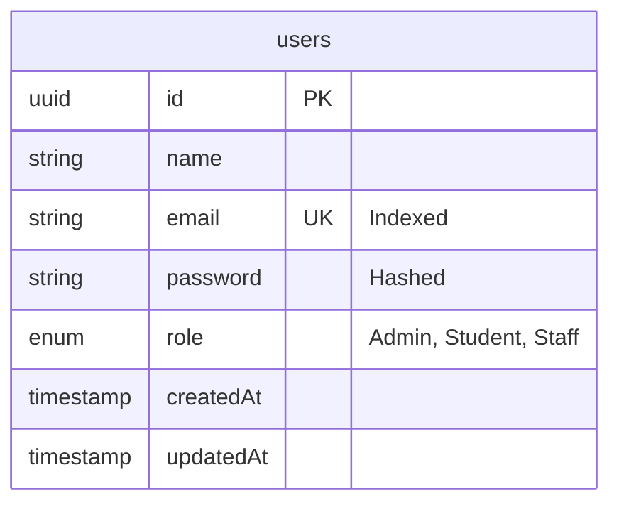
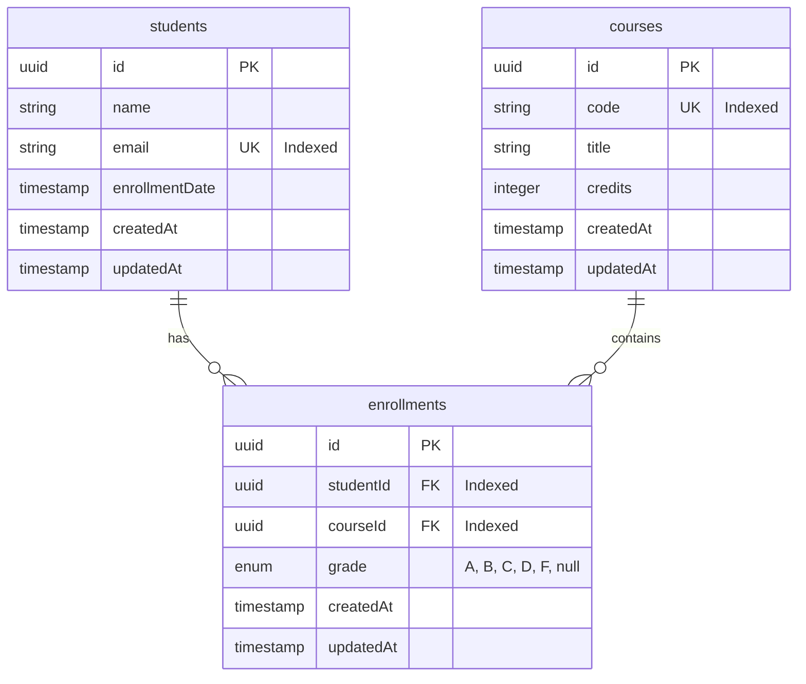
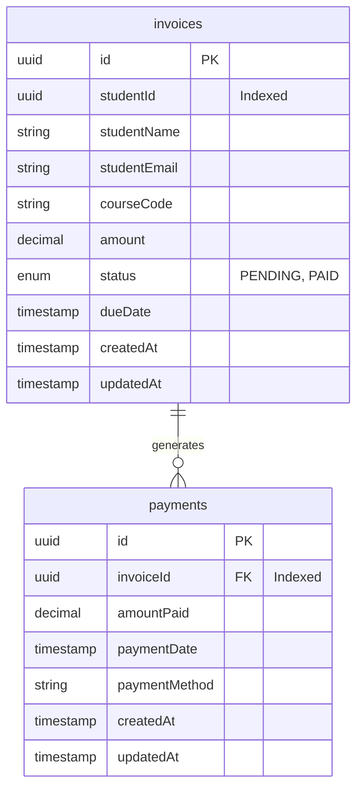
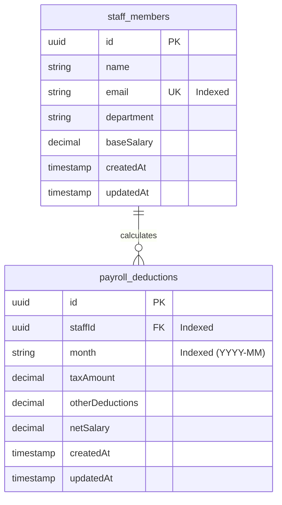

# Database Design & ERD Documentation

This document describes the database schemas for the four microservices (`auth-service`, `academic-service`, `finance-service`, `hr-service`) using PostgreSQL.

---

## 1. Entity-Relationship Diagrams (ERD)

### Auth Module (`erp_auth` database)

### Academic Module (`erp_academic` database)

### Finance Module (`erp_finance` database)

### HR Module (`erp_hr` database)

---

## 2. 3NF (Third Normal Form) Design Proofs

A database schema is in **Third Normal Form (3NF)** if it is in Second Normal Form (2NF) and contains no transitive functional dependencies (i.e., non-prime attributes must depend only on the primary key, the whole primary key, and nothing but the primary key).

- **Auth Module (`users` table)**:
  All attributes (`name`, `email`, `password`, `role`) depend directly on the primary key `id`. There are no transitive dependencies.

- **Academic Module**:
  - `students`: `name`, `email`, and `enrollmentDate` depend solely on the primary key `id`.
  - `courses`: `code`, `title`, and `credits` depend solely on `id`.
  - `enrollments`: Rather than storing student details (like name) or course details (like credits) in this table, we store only foreign keys `studentId` and `courseId`. The `grade` depends solely on the composite combination of `studentId` and `courseId`. This avoids redundant data duplication and updates anomalies.

- **Finance Module**:
  - `invoices`: `studentId`, `amount`, and `dueDate` depend directly on the primary key `id`. (We store snapshots of `studentName`, `studentEmail`, and `courseCode` at billing time to ensure invoice immutability—this is a design requirement for finance audits where student names or emails may change in the future, meaning it does not violate normalization rules but represents operational ledger state).
  - `payments`: `amountPaid` and `paymentDate` depend directly on `id` and link to `invoiceId`.

- **HR Module**:
  - `staff_members`: `name`, `email`, `department`, and `baseSalary` depend solely on `id`.
  - `payroll_deductions`: `taxAmount`, `otherDeductions`, and `netSalary` depend on the composite key `(staffId, month)`. This ensures each staff member has exactly one payroll slip calculated per month.

---

## 3. Database Indexing Strategy

To protect and speed up queries under load (satisfying **Week 2: Protect and speed up your data**), we have explicitly added indexes to columns that are searched frequently:

1. **Email Indexes (`users.email`, `students.email`, `staff_members.email`)**:
   - *Why*: During login and registration checks, the database looks up records by email. Indexing this field reduces the lookup complexity from $O(N)$ (table scan) to $O(\log N)$ (B-Tree index lookup), ensuring sub-millisecond response times even with millions of users.
2. **Foreign Key Indexes (`enrollments.studentId`, `enrollments.courseId`)**:
   - *Why*: Queries requesting transcripts or student schedules perform joins on these foreign keys. Indexing them avoids full table scans during joins.
3. **Billing and Payment Lookup Indexes (`invoices.studentId`, `payments.invoiceId`)**:
   - *Why*: A student checking their invoices or paying an invoice triggers queries filtered by `studentId` or `invoiceId`. 
4. **Composite Uniqueness Indexes (`enrollments(studentId, courseId)`, `payroll_deductions(staffId, month)`)**:
   - *Why*: Ensures data integrity at the database engine level (e.g., prevents double-enrolling a student in the same course, or double-calculating payroll for the same month).
